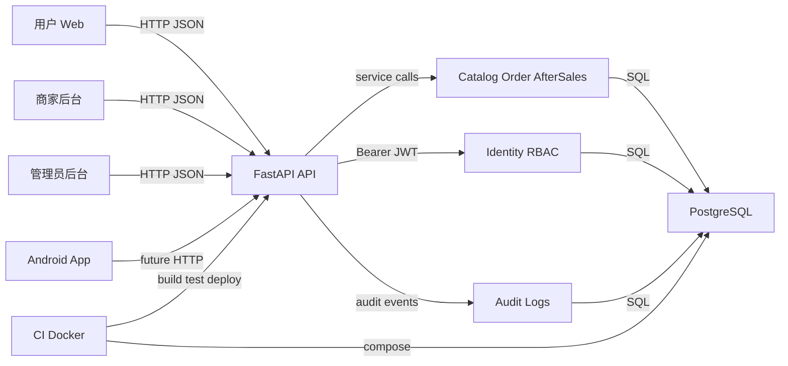

# M5 安全威胁模型

## 执行摘要

本仓库是类京东多端电商平台，M5 的最高风险集中在三类路径：身份与 RBAC 的越权边界、订单/库存/售后/退款状态机的完整性、以及发布配置把本地开发默认值带到可访问环境。现有代码已经实现 JWT、账号类型隔离、角色权限、商家 `merchant_ids` 数据范围、幂等键、状态事件、审计日志、安全响应头和生产默认密钥校验；但仍需要重点复核敏感字段脱敏、登录限流、真实支付/退款接入前的二次审批与回调签名、容器化 migration 能力、以及 Web/Android 与 API 的真实集成边界。

## 范围与假设

范围：

| 类别 | 路径 |
|---|---|
| 后端运行时 | `apps/api/app/**` |
| 数据模型与 migration | `apps/api/migrations/**` |
| API 安全测试证据 | `apps/api/tests/test_auth.py`、`apps/api/tests/test_health.py`、`apps/api/tests/test_orders.py`、`apps/api/tests/test_after_sales.py` |
| Web 入口 | `apps/web/app/**`、`apps/web/components/**`、`apps/web/lib/**` |
| Android 入口 | `apps/android/app/**`、`apps/android/README.md` |
| 部署与 CI | `.env.example`、`infra/docker/**`、`.github/workflows/ci.yml` |
| M5 验收与发布材料 | `scripts/verify-m5.sh`、`docs/qa/m5-hardening-launch-checklist.md`、`docs/release/m5-hardening-launch.md` |
| 产品安全契约 | `docs/product/rbac-matrix.md`、`docs/product/order-state-machine.md`、`docs/product/after-sales-state-machine.md`、`docs/api/openapi-change-log.md` |

不在本次范围：

- 生产云厂商网络、WAF、TLS 终止、KMS、日志平台和真实支付渠道配置，仓库没有这些证据。
- 第三方支付、真实物流、短信/邮件、对象存储上传，当前 M4/M5 文档明确为模拟或后续深化。
- 非 M5 相关的本地脚本、个人工具输出和临时 Playwright artifacts。

显式假设：

- API 最终会暴露给用户 Web、Android、商家后台和管理员后台；当前本地默认是 `localhost`。
- PostgreSQL 存储用户、角色、商品、库存、订单、售后、退款、工单和审计日志。
- Web 目前主要使用 demo 数据和静态登录表单，尚未形成真实 token 存储与 API 调用边界。
- Android 当前是 Compose 壳，不含网络权限和 API 客户端。
- M5 发布仍是演示/预生产级别；真实支付、真实退款和生产级对象存储接入前必须重新校准威胁优先级。

会显著改变风险排序的开放问题：

- 生产是否公网暴露 API，是否有网关/WAF/限流和 TLS 强制？
- Bearer token 在 Web/Android 端如何存储，是否使用 httpOnly cookie、Secure Storage 或纯内存？
- 管理员和商家账号是否有 MFA、IP 白名单、审批流和账号生命周期治理？
- 审计日志是否会集中采集到不可篡改存储，并设置退款/越权/失败登录告警？

## 系统模型

### 主要组件

| 组件 | 说明 | 证据 |
|---|---|---|
| FastAPI API | 注册 `/api/v1` 路由，生产隐藏 docs/openapi，启用 CORS、TrustedHost 和安全响应头 | `apps/api/app/main.py` |
| Identity/RBAC | 账号类型、角色、权限、JWT、密码哈希、权限依赖、审计拒绝 | `apps/api/app/domains/identity/**` |
| Catalog/Inventory | 公开商品浏览、商家商品和库存维护、库存预留/释放/扣减 | `apps/api/app/api/v1/routers/catalog.py`、`apps/api/app/domains/catalog/service.py` |
| Cart/Order/Payment | 购物车、结算、订单创建、模拟支付、支付超时关闭 | `apps/api/app/api/v1/routers/orders.py`、`apps/api/app/domains/order/service.py` |
| After-sales/Refund/Work order | 售后申请、商家审核、客服裁定、退款失败重试、超时推进 | `apps/api/app/api/v1/routers/after_sales.py`、`apps/api/app/domains/after_sales/service.py` |
| PostgreSQL | 业务数据和审计数据存储，SQLModel/Alembic 管理 schema | `apps/api/app/db/session.py`、`apps/api/migrations/versions/**` |
| Web | Next.js 多入口页面，目前使用 demo 数据 | `apps/web/app/**`、`apps/web/lib/*-demo.ts` |
| Android | Compose 工程壳，当前无 API 客户端和网络权限 | `apps/android/app/src/main/AndroidManifest.xml`、`apps/android/app/src/main/java/com/example/commerce/MainActivity.kt` |
| CI/Docker | API/Web/Android 三条 CI job，Compose 启动 API 和 Postgres | `.github/workflows/ci.yml`、`infra/docker/docker-compose.yml` |

### 数据流与信任边界

- Internet/Web/Android -> FastAPI：HTTP JSON 请求，包含注册、登录、商品浏览、购物车、订单、售后、后台操作；认证使用 Bearer JWT，Pydantic schema 做字段长度、枚举、范围和 `extra="forbid"` 校验；仓库未见全局限流。证据：`apps/api/app/api/v1/routers/*.py`、`apps/api/app/domains/*/schemas.py`。
- FastAPI -> Identity/RBAC：登录后用 PyJWT `exp/sub/typ` 解码，按数据库角色计算权限和 `merchant_ids`，`require_permissions` 校验账号类型和权限。证据：`apps/api/app/domains/identity/security.py`、`apps/api/app/domains/identity/dependencies.py`。
- FastAPI -> PostgreSQL：SQLModel Session 访问业务表；订单、支付、售后、退款和库存预留依赖唯一约束和事务提交处理幂等。证据：`apps/api/app/db/session.py`、`apps/api/app/domains/order/models.py`、`apps/api/app/domains/after_sales/models.py`。
- Customer -> Order/After-sales：用户只能操作本人购物车、订单和售后；服务层按 `customer_id` 或 `order_item.customer_id` 拦截。证据：`apps/api/app/domains/order/service.py:get_customer_order`、`apps/api/app/domains/after_sales/service.py:create_after_sales_request`。
- Merchant -> Merchant-scoped data：商家 token 中的 `merchant_ids` 限制商品、库存、订单和售后范围；缺少 scope 返回 403。证据：`apps/api/app/api/v1/routers/catalog.py:get_primary_merchant_id`、`apps/api/app/domains/after_sales/service.py:require_merchant_scope`。
- Admin -> Platform operations：管理员按细分权限读取订单/售后、裁定售后、重试退款、触发超时任务；客服、财务、主管权限拆分。证据：`apps/api/app/domains/identity/constants.py`、`apps/api/app/api/v1/routers/after_sales.py`。
- FastAPI -> Audit log：注册、登录失败/成功、权限拒绝、商品/库存/订单/售后敏感写操作写入 `audit_logs`；资源 ID 和 User-Agent 有长度截断。证据：`apps/api/app/domains/identity/audit.py`、`apps/api/tests/test_auth.py`。
- CI/Operator -> Build/Deploy：CI 执行 API ruff/pytest/alembic SQL、Web lint/type/build、Android lint/test/assembleDebug；Compose 使用默认本地 DB 和 API 环境变量。证据：`.github/workflows/ci.yml`、`infra/docker/docker-compose.yml`。

#### 图

## 资产与安全目标

| 资产 | 为什么重要 | 安全目标 C/I/A |
|---|---|---|
| 用户账号、密码哈希、JWT | 账号接管会导致订单、地址、售后和资金风险 | C/I |
| 管理员和商家角色权限 | 决定后台入口、退款、超时任务和数据范围 | I |
| 用户 PII | 收货人、手机号、地址、订单与售后证据会造成隐私伤害 | C |
| 商品、SKU、价格、库存 | 改价、下架、超卖直接影响交易完整性 | I/A |
| 订单、支付单、订单状态事件 | 交易事实来源，影响履约和售后 | I/A |
| 售后单、退款单、工单 | 资金流和客服裁定核心证据 | C/I |
| 审计日志 | 追责、风控、合规和事后调查依据 | I/A |
| 配置与密钥 | JWT secret、数据库 URL、生产 CORS/Host 决定整体边界 | C/I |
| CI 构建产物和依赖锁 | 供应链被污染可进入发布版本 | I |
| PostgreSQL 数据卷 | 演示和预生产数据持久化，回滚依赖备份 | C/I/A |

## 攻击者模型

### 能力

- 未认证公网用户：可访问公开商品、注册和登录接口，提交 JSON、查询参数和请求头。
- 已认证普通用户：可重复下单、支付模拟、发起售后、补证、撤销、申请客服介入。
- 已认证商家员工：可管理本商家商品/库存，查看和处理本商家订单/售后。
- 已认证管理员：根据角色拥有订单、售后、客服、财务、超时任务或审计权限。
- 被动网络或终端窃取者：可能拿到 Bearer token、日志片段或本地演示配置。
- 供应链攻击者：可能通过依赖、CI action 或构建上下文影响构建输出。

### 非能力

- 默认不假设攻击者能直接访问生产数据库或宿主机 shell。
- 默认不假设攻击者控制支付渠道或物流渠道，因为当前仅模拟支付/退款。
- 默认不假设 Web/Android 已有真实 token 存储缺陷；当前代码尚未实现该边界。
- 默认不把开发缓存目录、`.next`、`.venv`、`node_modules` 作为生产运行时事实。

## 入口点与攻击面

| Surface | How reached | Trust boundary | Notes | Evidence |
|---|---|---|---|---|
| 注册 | `POST /api/v1/auth/register` | 未认证用户 -> API/DB | 只允许普通用户自注册，重复邮箱审计 | `apps/api/app/api/v1/routers/auth.py` |
| 登录 | `POST /api/v1/auth/login` | 未认证用户 -> API/JWT | 无仓库级限流/锁定证据，失败审计 | `apps/api/app/api/v1/routers/auth.py`、`apps/api/tests/test_auth.py` |
| Bearer JWT | `Authorization: Bearer` | 客户端 token -> RBAC | 校验 `exp/sub/typ`，无撤销表 | `apps/api/app/domains/identity/security.py` |
| 公开目录/商品 | `GET /categories`、`/brands`、`/products` | Internet -> API/DB | 查询长度、分页限制；公开只读 | `apps/api/app/api/v1/routers/catalog.py` |
| 商家商品/库存 | `/merchant/products`、`/merchant/inventory` | 商家 -> API/DB | `merchant_ids` scope，库存写审计 | `apps/api/app/api/v1/routers/catalog.py` |
| 用户购物车/订单/模拟支付 | `/cart`、`/checkout`、`/orders` | 用户 -> API/DB | 幂等订单/支付，库存预留/扣减 | `apps/api/app/api/v1/routers/orders.py` |
| 商家订单 | `/merchant/orders` | 商家 -> API/DB | 按订单行商家 scope | `apps/api/app/domains/order/service.py:has_merchant_order_scope` |
| 管理员订单任务 | `/admin/orders/expire-unpaid` | 管理员 -> 系统任务 | 关闭超时订单，释放库存，写审计 | `apps/api/app/api/v1/routers/orders.py` |
| 用户售后 | `/after-sales/**` | 用户 -> API/DB | 本人订单行、金额/数量校验、幂等 | `apps/api/app/domains/after_sales/service.py` |
| 商家售后 | `/merchant/after-sales/**` | 商家 -> API/DB | 商家审核、拒绝、确认收货 | `apps/api/app/api/v1/routers/after_sales.py` |
| 管理员售后/退款/工单 | `/admin/after-sales/**`、`/admin/work-orders` | 管理员 -> 高危业务状态 | 客服裁定、财务重试、主管超时推进 | `apps/api/app/api/v1/routers/after_sales.py` |
| 健康检查 | `/api/v1/health/live`、`/ready` | 监控 -> API/DB | ready 查询数据库 | `apps/api/app/api/v1/routers/health.py` |
| OpenAPI/Docs | `/openapi.json`、`/docs` | 开发者 -> API schema | production 隐藏，local 可见 | `apps/api/app/main.py`、`apps/api/tests/test_health.py` |
| CORS/Host/Header | HTTP headers | Browser/Proxy -> API | 拒绝 wildcard CORS，TrustedHost，安全头 | `apps/api/app/core/config.py`、`apps/api/app/core/middleware.py` |
| Docker Compose | `docker compose -f infra/docker/docker-compose.yml up` | Operator -> runtime | Postgres 默认凭据和本地端口暴露 | `infra/docker/docker-compose.yml`、`.env.example` |
| CI | pull_request/push | Developer -> artifacts | API/Web/Android checks；Action 只 pin major | `.github/workflows/ci.yml` |
| Web 页面 | Next.js routes | Browser -> Web | 当前 demo 数据/静态登录表单 | `apps/web/app/**`、`apps/web/lib/*-demo.ts` |
| Android App | Launcher Activity | Device -> App | 当前无网络权限/API 客户端 | `apps/android/app/src/main/AndroidManifest.xml` |

## 主要 abuse paths

1. 凭据填充获得普通用户账号 -> 调用本人订单/售后接口 -> 创建高频退款或读取地址/手机号 -> 造成隐私和资金风险。
2. 攻击者复用泄露的商家 Bearer token -> 枚举 `/merchant/orders/{id}` 或 `/merchant/after-sales/{id}` -> 若 scope 漏检则跨商家读取订单/售后 -> 泄露其他店铺交易与用户信息。
3. 低权限管理员或被盗客服账号 -> 调用售后裁定或超时任务 -> 绕过财务复核批准退款 -> 造成资金损失和审计压力。
4. 用户重复提交订单/支付/售后请求并变更 payload -> 试图复用幂等键绕过库存和金额校验 -> 如果请求签名或唯一约束失效，可能重复锁库存或重复退款。
5. 多个用户并发下单同一 SKU -> 攻击库存条件更新和事务边界 -> 若库存预留不是原子操作会超卖或库存长期占用。
6. 攻击者利用本地/预生产 Docker 默认配置上线 -> 默认 JWT secret、默认 DB 密码或 Postgres 端口暴露 -> 伪造 token 或直接访问数据。
7. 攻击者提交超长原因、证据 URL、User-Agent 或详情字段 -> 污染审计/工单/售后事件 -> 影响排查、页面渲染或日志存储。
8. 供应链攻击者污染 npm/Python/Action 依赖 -> CI 构建通过但产物执行恶意代码 -> 窃取密钥或篡改发布版本。
9. Web/Android 后续接 API 时把 token 存到不安全位置 -> XSS、设备备份或日志泄露 token -> 攻击后台或用户主流程。

## 威胁模型表

| Threat ID | Threat source | Prerequisites | Threat action | Impact | Impacted assets | Existing controls (evidence) | Gaps | Recommended mitigations | Detection ideas | Likelihood | Impact severity | Priority |
|---|---|---|---|---|---|---|---|---|---|---|---|---|
| TM-001 | 未认证远程攻击者 | 登录接口公网可达，攻击者有邮箱字典或泄露密码 | 对 `POST /auth/login` 做凭据填充或密码喷洒 | 账号接管、PII 泄露、恶意售后 | 用户账号、订单、售后、PII | 密码哈希 `pwdlib[argon2]`，失败写审计；`apps/api/app/domains/identity/security.py`、`apps/api/app/api/v1/routers/auth.py` | 未见限流、账号锁定、MFA、验证码或 IP 风控 | 在网关/API 加登录限流和失败窗口；管理员/商家强制 MFA；对高风险登录写风控事件 | 失败登录按 IP/账号聚合告警，异地登录告警 | high | high | high |
| TM-002 | token 窃取者或配置错误操作者 | Bearer token 泄露，或非 production 使用默认 JWT secret 暴露 | 伪造或重放 JWT 调用 API | 越权访问、后台操作、订单/售后篡改 | JWT、账号权限、业务状态 | JWT 要求 `exp/sub/typ`，production 拒绝默认 secret；`apps/api/app/domains/identity/security.py`、`apps/api/app/core/config.py` | 无 token 撤销/刷新令牌轮换；Compose `APP_ENV=docker` 未强制 secret；客户端存储未实现 | 所有共享环境强制非默认 secret；引入 token version/撤销表；管理员短 TTL；客户端使用 httpOnly cookie 或安全存储 | token 失败解码、异常 admin API 调用、同 token 多 IP 告警 | medium | high | high |
| TM-003 | 已认证用户/商家/管理员 | 新增接口忘记调用 `require_permissions` 或服务层 scope | 枚举订单、售后、商品、库存 ID 读取或操作他人/跨店铺数据 | 多租户数据泄露、跨商家操作 | PII、订单、售后、库存、退款 | `require_permissions` 校验账号类型/权限；商家 scope 和测试覆盖；`apps/api/app/domains/identity/dependencies.py`、`apps/api/tests/test_orders.py`、`apps/api/tests/test_after_sales.py` | 字段权限和列表脱敏尚不完整；未来新接口容易漏 scope | 为每个 router 建权限矩阵测试；服务层统一 owner/scope helper；列表和详情分字段脱敏 | 403 审计聚合、跨商家 ID 枚举模式告警 | medium | high | high |
| TM-004 | 被盗商家/管理员账号或内部误用 | 具备售后审核、客服裁定、财务重试或超时任务权限 | 通过售后接口批准退款、重试退款或自动推进大量单据 | 资金损失、客服/财务追责困难 | 退款、售后、工单、审计 | 权限拆分 `after_sales:decide/refund:retry/auto_progress`，幂等事件；`apps/api/app/domains/identity/constants.py`、`apps/api/app/api/v1/routers/after_sales.py` | 无大额二次审批、MFA、四眼复核；模拟退款成功参数由请求携带，真实接入前必须移除 | 大额/高频/风控命中退款进入审批；真实渠道结果只能由服务端回调决定；限制 auto-progress 批量和时间窗口 | 退款金额、次数、操作者、状态跳转异常告警 | medium | high | high |
| TM-005 | 并发下单用户或恶意自动化 | 热门 SKU、重复请求、支付/超时任务并发 | 竞争库存预留、支付成功和超时关闭 | 超卖、库存长占、订单状态不一致 | 库存、订单、支付单 | 条件更新库存，唯一幂等约束，请求签名；`apps/api/app/domains/catalog/service.py:reserve_inventory`、`apps/api/app/domains/order/service.py:create_order_from_cart` | 订单支付/超时未见行级锁；无压力测试证据 | 对订单支付/超时使用条件更新或行锁；增加并发集成测试；建立库存异常修复任务 | 库存负数、reserved 大于 on_hand、同订单多终态告警 | medium | high | high |
| TM-006 | 远程用户或商家 | 接口返回完整地址/手机号给不需要的角色 | 利用列表/详情接口批量读取 PII | 隐私泄露、合规风险 | 收货人、手机号、地址、证据 URL | 角色/数据范围控制；`docs/product/rbac-matrix.md`、`apps/api/app/domains/order/schemas.py` | `OrderPublic` 包含完整地址/手机号；未见字段级脱敏实现和敏感字段访问审计 | 为用户/商家/客服/财务定义不同 response model；列表默认脱敏；敏感字段读取单独审计 | 管理/商家批量详情访问和导出行为告警 | medium | high | high |
| TM-007 | 远程用户或未来证据处理服务 | 用户提交 evidence URLs、描述、原因、User-Agent 等文本 | 日志/审计/页面污染，未来若服务端抓取 URL 则变成 SSRF | 审计失真、存储膨胀、潜在 SSRF | 审计日志、工单、售后证据 | Pydantic 长度限制、audit 截断；`apps/api/app/domains/after_sales/schemas.py`、`apps/api/app/domains/identity/audit.py` | `evidence_urls` 当前只长度限制，不校验 scheme/domain；details 用 `str(dict)` 写入 | URL 只允许 https 和可信对象存储；日志用结构化 JSON；渲染时统一转义；禁止后端任意抓取 | 非 https URL、内网 IP URL、超长字段拒绝统计 | medium | medium | medium |
| TM-008 | 操作者或外部扫描者 | Docker Compose 或本地配置被误用于共享环境 | 默认 DB 密码、Postgres 端口、API 无 TLS、未执行 migration job | 数据暴露、不可升级、发布不可回滚 | DB、配置、发布产物 | production 拒绝默认 JWT secret，CORS wildcard 拒绝，API 镜像复制 Alembic 文件；`apps/api/app/core/config.py`、`apps/api/tests/test_health.py`、`infra/docker/Dockerfile.api` | Compose 默认 `commerce/commerce`，`APP_ENV=docker` 不等于 production，Postgres 暴露本机端口；Compose 未内置一次性 migration job | 发布前强制 `.env` 覆盖；生产不暴露 DB；使用独立 migration job；网关强制 TLS | 启动时输出环境校验失败；端口暴露扫描；ready 检查和 migration 版本检查 | high | medium | high |
| TM-009 | 供应链攻击者 | 依赖或 CI action 被劫持，开发者合并 PR | 构建时执行恶意包或 Action，篡改产物/窃取 secret | 发布完整性破坏 | CI、依赖锁、构建产物、secrets | `package-lock.json`、`uv.lock`、CI 分 job；`.github/workflows/ci.yml` | GitHub Actions 只 pin major；Docker `pip install .` 未使用 lock/hash；缺少依赖审计 | Pin Action 到 SHA；CI 加 npm audit/pip-audit 或 osv-scanner；Docker 构建使用 lockfile；限制 PR secret 暴露 | 依赖变更 diff 审查，异常 postinstall，Action 版本漂移告警 | medium | medium | medium |

## High risk owners and M5 disposition

| Threat IDs | Owner | M5 disposition |
|---|---|---|
| TM-001 | `backend-agent` + security reviewer | Demo/pre-production accepted with audit coverage; production blocked until login rate limiting and admin/merchant MFA are added. |
| TM-002 | `infra-agent` + `backend-agent` | Demo/pre-production accepted with production default secret tests; shared environments must use strong `JWT_SECRET_KEY` and documented token storage before release. |
| TM-003 | `backend-agent` + `qa-agent` | Mitigated for current routers by RBAC/scope tests and M5 E2E; every new router needs permission matrix tests. |
| TM-004 | `backend-agent` + platform finance owner | Demo/pre-production accepted because refunds are simulated; real payment/refund launch is blocked until large-amount approval and channel callback controls exist. |
| TM-005 | `backend-agent` + `qa-agent` | Mitigated by current idempotency and inventory tests; production-scale launch needs PostgreSQL concurrency testing and stock anomaly alerts. |
| TM-006 | `backend-agent` + `web-admin-agent` | Accepted as a known M5 limitation; production launch requires role-specific response models, masking, and sensitive-field read audit. |
| TM-008 | `infra-agent` | Mitigated for local smoke by Compose config checks and Dockerfile migration file copy; shared/production deployment blocked until secrets, DB exposure, TLS, and migration job are configured. |

## Criticality calibration

| 等级 | 本项目判定标准 | 示例 |
|---|---|---|
| critical | 可远程、低门槛、跨角色或跨租户影响资金/大量 PII/生产密钥，且缺少有效补偿控制 | 伪造管理员 JWT；跨商家批量读取订单地址；无需审批批量退款成功 |
| high | 需要认证或配置错误，但会影响资金、订单/库存完整性、后台高权限或敏感 PII | 凭据填充接管账号；库存并发导致超卖；客服账号被盗后裁定退款 |
| medium | 影响局部数据、审计可靠性、发布质量或未来接入风险，有现有控制降低影响 | 证据 URL 未规范化；CI action 未 pin SHA；演示 Compose 默认凭据用于内网测试 |
| low | 需要不现实前提或只影响开发体验/低敏信息，不直接影响资金和 PII | local docs 暴露 OpenAPI；Android 壳没有网络权限导致功能不可用 |

## Focus paths for security review

| Path | Why it matters | Related Threat IDs |
|---|---|---|
| `apps/api/app/domains/identity/security.py` | JWT 生成/校验、密码哈希和 token 语义源头 | TM-001, TM-002 |
| `apps/api/app/domains/identity/dependencies.py` | 所有受保护 API 的认证、权限和账号类型校验 choke point | TM-002, TM-003 |
| `apps/api/app/domains/identity/constants.py` | 角色到权限映射决定后台高危操作边界 | TM-003, TM-004 |
| `apps/api/app/domains/identity/audit.py` | 审计字段截断和日志写入质量影响追责 | TM-007 |
| `apps/api/app/core/config.py` | CORS、Host、JWT secret 和生产配置校验 | TM-002, TM-008 |
| `apps/api/app/main.py` | 中间件、OpenAPI 暴露和 router 注册 | TM-008 |
| `apps/api/app/api/v1/routers/auth.py` | 登录/注册入口，暴力破解和账号枚举首要路径 | TM-001 |
| `apps/api/app/api/v1/routers/catalog.py` | 商家商品、库存和公开商品边界 | TM-003, TM-005 |
| `apps/api/app/domains/catalog/service.py` | 库存预留、释放、扣减和商家 ownership 校验 | TM-005 |
| `apps/api/app/api/v1/routers/orders.py` | 订单、支付、管理员超时任务入口 | TM-003, TM-005, TM-006 |
| `apps/api/app/domains/order/service.py` | 订单幂等、支付状态、库存联动和商家订单 scope | TM-003, TM-005 |
| `apps/api/app/api/v1/routers/after_sales.py` | 售后、客服裁定、财务重试和超时推进入口 | TM-004, TM-006 |
| `apps/api/app/domains/after_sales/service.py` | 售后状态机、退款创建、工单和幂等事件 | TM-004, TM-007 |
| `apps/api/app/domains/order/schemas.py` | 返回模型包含 PII，需要字段权限复核 | TM-006 |
| `apps/api/app/domains/after_sales/schemas.py` | 证据 URL、退款金额、客服/商家操作 payload | TM-004, TM-007 |
| `apps/api/migrations/versions/20260716_0001_identity_rbac.py` | 用户、角色、审计表约束与索引 | TM-002, TM-003 |
| `apps/api/migrations/versions/20260716_0003_order_workflow.py` | 订单、支付、库存相关约束 | TM-005 |
| `apps/api/migrations/versions/20260716_0004_after_sales.py` | 售后、退款、工单约束 | TM-004 |
| `infra/docker/docker-compose.yml` | 默认凭据、端口暴露和运行时环境 | TM-008 |
| `infra/docker/Dockerfile.api` | 镜像内容和 migration 可执行性 | TM-008, TM-009 |
| `.github/workflows/ci.yml` | 发布前质量门禁和供应链控制 | TM-009 |
| `apps/web/components/login-shell.tsx` | 后续真实登录 token 处理入口 | TM-002, TM-009 |
| `apps/android/app/src/main/AndroidManifest.xml` | 后续 Android 网络/API 权限和备份策略入口 | TM-002, TM-009 |

## 质量检查

| 检查项 | 结论 |
|---|---|
| 已覆盖发现的入口点 | 是，覆盖 auth、catalog、cart/order/payment、merchant/admin、after-sales、health、Docker/CI、Web/Android |
| 每个信任边界至少关联一个威胁 | 是，JWT/RBAC、用户/商家/管理员、API/DB、CI/部署均有威胁项 |
| 已区分运行时与 CI/dev | 是，Docker/CI/Web demo/Android 壳与 API runtime 分开描述 |
| 已记录假设和开放问题 | 是，见范围与假设 |
| 证据锚点为 repo 相对路径 | 是 |
